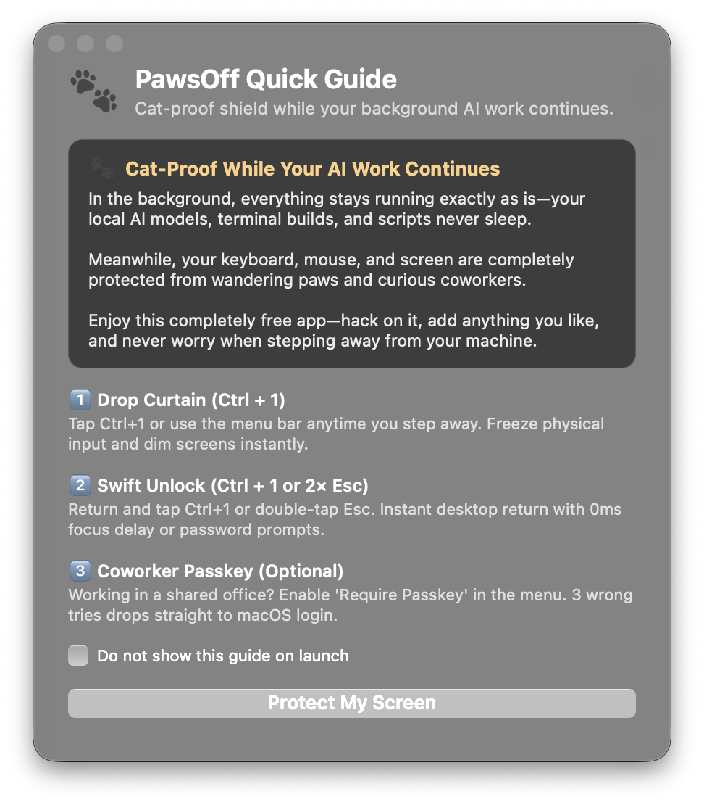

<div align="center">
  
  <h1>PawsOff</h1>
  <p><strong>Zero-Interruption macOS Screen Curtain & Physical Input Shield</strong></p>
  <p>
    <a href="https://github.com/LeonidMajbits/pawsoff/releases"></a>
    
    
    
    
    <a href="LICENSE"></a>
  </p>
  <br />
  
  <br />
</div>

---

## Why PawsOff?

Stepping away from your Mac usually forces an irritating compromise:

1. **Locking your Mac (`Cmd + Ctrl + Q` or Sleep)**: macOS shuts off displays, disconnects WindowServer context, and triggers system idle sleep. This interrupts local LLM inference (Ollama, LM Studio), pauses multi-turn AI agent loops, terminates long compiler builds, and halts background render jobs.
2. **Leaving your Mac unlocked**: A wandering cat jumps on the warm mechanical keyboard—accidentally pressing `Ctrl+C` on a 6-hour model run, accepting Git merge conflicts, or typing gibberish into Slack. In a shared office, curious coworkers can glance at private drafts or unfinished architecture.

**PawsOff is the middle path.** With a single tap of **`Ctrl + 1`**, it drops an interactive frosted glass curtain across all connected displays, holding physical inputs completely frozen while **holding user-space power assertions so your background AI models, builds, and daemons run at 100% full speed**.

---

## Key Features & What's New in v1.2.0

* 🐾 **Complete Physical Input Freeze**:
  AppKit window-level key shield swallows 100% of routine keyboard events, mouse clicks, drags, and trackpad scrolling before they can reach underlying applications.
* ⚡ **Zero-Latency Focus Restoration**:
  When you dismiss the curtain, PawsOff automatically remembers which application you were using (Terminal, Xcode, browser) and seamlessly restores focus with 0ms delay.
* ☕ **Zero Sleep Throttling**:
  Acquires `kIOPMAssertPreventUserIdleDisplaySleep` and `kIOPMAssertPreventUserIdleSystemSleep` power assertions exclusively while armed. Your background scripts and models never sleep.
* 🏢 **Enterprise Passkey & The "Never-Trapped" Fail-Safe**:
  Working in an open-concept office? Turn on **Require Passkey** in settings to protect the curtain with a 4–8 digit PIN, salted and hashed via Apple `CryptoKit` (SHA-256).
  * *Forgot your PIN?* Three consecutive failed attempts or clicking **"Forgot Passkey / Use Mac Password"** immediately cleans up input hooks and calls Apple's native `SACLockScreenImmediate()`, dropping your Mac straight to the encrypted macOS login window. You are **never trapped** or forced to hard-reset.
* 🎨 **Frosted Glass Aesthetic**:
  Adjustable blur and tint sliders. Tint is strictly capped at 82% to ensure mouse cursor silhouette and desktop contrast remain visible.
* 📖 **Built-in Quick Guide HUD**:
  A friendly, dark floating card explaining the core shortcuts and principles. Dismissable forever with "Do not show on launch".
* 🔒 **100% Sovereign & Offline**:
  Zero cloud dependencies, zero analytics, zero external Swift packages. Only standard macOS frameworks (AppKit, Carbon, CoreGraphics, ApplicationServices, IOKit, CryptoKit).

---

## Quick Controls & Pro-Tips

| Action | Shortcut / Gesture | Result |
| :--- | :--- | :--- |
| **Drop Curtain** | `Ctrl + 1` | Instantly dims screens and freezes all physical keyboard/mouse input. |
| **Instant Unlock** | `Ctrl + 1` | Dismisses curtain; previous application immediately regains focus. |
| **Emergency Unlock** | **Double-tap `Esc`** | Two distinct Escape key presses within 650 ms dismiss the curtain. |
| **Passkey Unlock** | `[PIN] + Return` | Unlocks screen when Enterprise Passkey mode is enabled. |
| **Mac Password Fallback** | Click button / 3 wrong PINs | Disarms PawsOff and drops machine to native macOS login window. |

### 💡 Pro-Tips for Power Users

> [!TIP]
> **Mission Control Shortcut Conflict**:  
> In macOS, `Ctrl + 1` is sometimes bound by default to *"Switch to Desktop 1"*. If pressing `Ctrl + 1` switches Spaces instead of dropping PawsOff:  
> Open **System Settings → Keyboard → Keyboard Shortcuts → Mission Control**, and uncheck **"Switch to Desktop 1"** (or remap it). PawsOff will instantly claim the shortcut globally.

> [!NOTE]
> **ScreenCaptureKit Cooperation**:  
> PawsOff does not terminate ScreenCaptureKit capture streams. If you are recording your screen or running an AI desktop agent, configure your capture client's `SCContentFilter` to exclude `com.leonidmajbits.pawsoff`. See [`Docs/SCREEN_CAPTURE.md`](Docs/SCREEN_CAPTURE.md) for sample Swift code.

---

## 60-Second Quick Start

Requires macOS 13.0+ (Ventura, Sonoma, Sequoia) on Apple Silicon or Intel with Xcode Command Line Tools (`xcode-select --install`).

```bash
# 1. Clone the repository
git clone https://github.com/LeonidMajbits/pawsoff.git
cd pawsoff

# 2. Build and bundle the native app
make bundle

# 3. Launch PawsOff
open -g dist/PawsOff.app
```

### One-Time Permission Setup

1. Click the **PawsOff** paw icon in your macOS menu bar.
2. Select **Grant Accessibility…**.
3. Toggle `PawsOff.app` ON in **System Settings → Privacy & Security → Accessibility**.
4. Relaunch PawsOff once authorized. You're ready to go!

---

## Make Commands Cheat Sheet

| Command | Action |
| :--- | :--- |
| `make bundle` | Compiles release binary, bundles `dist/PawsOff.app`, and codesigns with designated requirement. |
| `make test` | Runs the 63-case core policy test suite and 41-check static source audit in ~1.5s. |
| `make run` | Builds bundle and launches `dist/PawsOff.app` in background. |
| `make verify` | Executes native macOS verification gate and logs host test evidence. |
| `make probes` | Compiles optional diagnostic probes (`focus-probe`, `input-probe`, `capture-probe`). |
| `make clean` | Removes local build outputs (`.build`, `dist`, `/tmp/pawsoff-build`). |

---

## Architecture & Security Boundaries

* **Cat Guard vs. Full Security Boundary**:  
  PawsOff is engineered to eliminate accidental keyboard/mouse disturbances and curious onlookers. It is not an adversarial cryptographic sandbox; anyone who knows the hotkey or enters the Mac password via the login fail-safe can unlock the machine.
* **Hardware & Kernel Control**:  
  System-level power keys, Touch ID sensors, and kernel-reserved accessibility gestures operate below user-space event taps and remain under OS control.
* **Privacy by Design**:  
  Zero keystrokes are recorded, stored, or transmitted. Only numerical key codes and modifier flags are transiently tracked in volatile RAM to cleanly drain held keys upon exit.

---

## Provenance & Authorship

Engineered under the **Triadic Sovereign Development Architecture**:
* **Human Operator & Architect**: **Leonid Majbits** (*Vision, core architectural invariants, system teleology, and patron verification*).
* **Executive Co-Architect & Verification Engine**: **Gemini Operator Lab (ZION Chassis)** *(AI architecture with persistent somatic memory, Apple Silicon metal grounding, stage contract enforcement, and multi-fleet direction)*.
* **Specialized Systems Foundries**: **External Frontier Models (OpenAI GPT-6 Max, Anthropic Claude, etc.)** *(Bounded multi-turn execution, heavy code synthesis, and adversarial stress-testing)*.

See [`NOTICE.md`](NOTICE.md) for full attribution details.

---

## License

MIT License. See [`LICENSE`](LICENSE) for complete terms.
